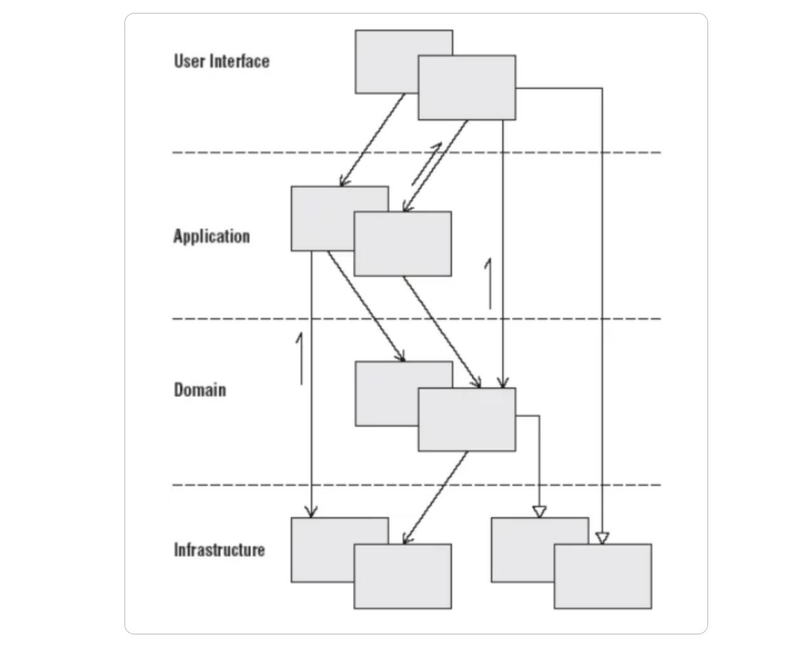
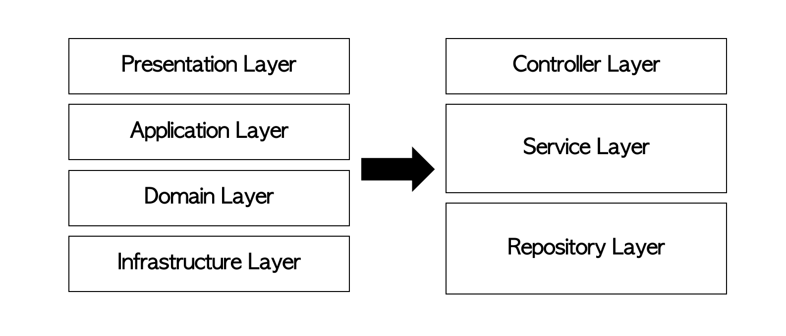
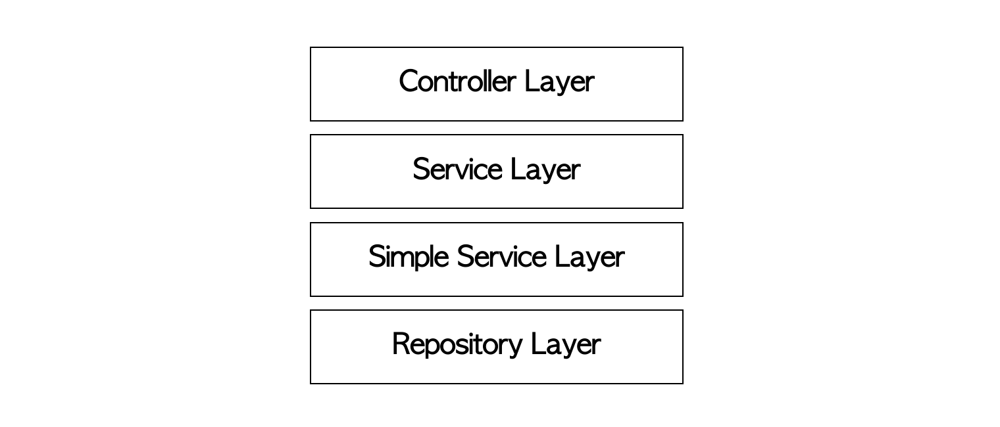

* TOC
{:toc}


I have always followed Layered Architecture while developing servers using Spring Boot. In the process, 
I faced various dilemmas, such as determining what tasks should be assigned to the Controller, Service, or Repository, 
how to distribute logic appropriately across layers, and whether responsibilities should be delegated to the domain. 

To gain a deeper understanding of Layered Architecture and its applications in Spring Boot, I delved into the concept. 
In this discussion, I'll explore the concept of Layered Architecture, its common usage in Spring Boot, 
and share my reflections and solutions to the challenges I encountered.

### **Concept of Layered Architecture**
Layered Architecture is a method of separating a software system into multiple logical layers. 
The primary reason for layer separation is the separation of concerns. Each layer has specific roles and responsibilities, 
with higher layers utilizing lower layers to perform functions. This structure reduces system complexity and
enhances maintainability. Let's delve into the advantages and disadvantages



**Advantages**
- Abstraction for Readable Code: 
Abstraction allows for writing readable code. Naming methods intuitively in lower layers enables understanding of the 
overall flow without delving into lower-level methods.
- Decoupling for Low Coupling: 
Separating layers reduces coupling, minimizing the impact of changes in one layer on others. Each layer can be developed, 
tested, and modified independently.
- High Reusability 
Methods defined in a lower layer, especially in the domain layer, can be reused across different services, 
enhancing code reusability.

**Disadvantages**
- Trade-off between Modularity and Performance
To lower coupling, additional processing steps such as casting or DTO conversion may be required when exchanging data 
between layers, potentially introducing overhead, especially for large and complex datasets.
- Limited Flexibility Changes in the lower layer may still necessitate modifications in the upper layers, 
limiting flexibility. Using an open-closed principle (closed for modification but open for extension) can help manage
this limitation.

### **Layered Architecture in Spring Boot**
In Spring Boot, a commonly adopted pattern is the 3-layered architecture: Controller Layer, Service Layer, 
and Repository Layer.


1. Controller Layer: Handles user requests, invokes Service Layer for business logic processing, and prepares response 
DTOs for frontend.
``` java
@PostMapping
public ResponseEntity<ApiResponse<RecipeResponse>> createRecipe(@CurrentUser User user, @RequestBody RecipeCreateRequest recipeCreateRequest){

    recipeService.deleteCancelledFiles(recipeCreateRequest);
    RecipeResponse response = recipeService.createRecipe(user, recipeCreateRequest);

    ApiResponse apiResponse = ApiResponse.builder()
            .message("Create Success")
            .status(HttpStatus.CREATED.value())
            .data(response)
            .build();

    return ResponseEntity.ok()
            .body(apiResponse);
}
```
2. Service Layer: Processes business logic, interacts with the Repository Layer for database operations, 
and may invoke other services for complex logic. It encapsulates domain objects and logic.
``` java
@Transactional
public RecipeResponse createRecipe(User user, RecipeCreateRequest request) {
    Util.validateDuplication(request.getIngredients(), request.getOptionalIngredients());

    List<Ingredient> requiredIngredients = ingredientSimpleService.getIngredientsByIds(request.getIngredients());
    List<Ingredient> optionalIngredients = ingredientSimpleService.getIngredientsByIds(request.getOptionalIngredients());

    Recipe recipe = recipeRepository.save(createRecipeEntity(user, request));

    saveNecessaryIngredientsOfRecipe(recipe, requiredIngredients);
    saveOptionalIngredientsOfRecipe(recipe, optionalIngredients);

    stepService.saveStepsForRecipe(recipe, request.getSteps());

    return RecipeResponse.builder()
            .recipeId(recipe.getId())
            .build();
}
```
3. Repository Layer: Responsible for data access and interaction with databases or external systems. 
Implements CRUD operations and provides infrastructure-specific implementations.
``` java
public interface RecipeRepository extends JpaRepository<Recipe, Long> {

    @EntityGraph(
            attributePaths = {"author", "steps"}, type = EntityGraphType.FETCH
    )
    Optional<Recipe> findAllElementsById(Long id);

    boolean existsById(Long recipeId);

    @Query(value = "select distinct r from Recipe r join fetch r.author ",
            countQuery = "select count(r) from Recipe r")
    Page<Recipe> findRecipes(Pageable pageable);
}
```
**Challenges Faced and Solutions**

1. Validation Responsibility: Determining where to perform validation can be challenging. 
Basic validations can be done in the Controller using bean validation, while more complex validations, 
including those related to business logic, are handled in the Service Layer.

2. Delineating Responsibilities: Striking a balance between hiding and revealing information is crucial. 
Over-wrapping methods in the Controller may reduce service method reusability. Optimal exposure of methods in the
Service Layer ensures meaningful abstraction without unnecessary wrapping.

3. Enhancing Service Method Reusability: To increase the reusability of simple service methods, 
a separate layer named [Domain]SimpleService can be introduced. This layer holds commonly reused methods across 
different domains, promoting cleaner organization.

4. 
These coding principles emphasize separating the flow and methods in service methods and maintaining consistent 
abstraction levels across methods.

## **conclusion**
Layered Architecture in Spring Boot offers a structured approach to system design, but careful consideration of 
responsibilities and code organization is essential for optimal development and maintainability.