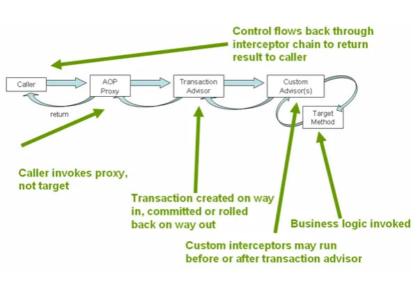

* TOC
{:toc}

### **How Spring Framework solves this problem**
through the abstraction provided by the PlatformTransactionManager interface. This interface serves as the top-level 
interface for transaction management, and the process involves registering an implementation of this interface as a 
Bean in the Spring configuration file and injecting it where needed.

For instance, there are different implementations of the PlatformTransactionManager interface, each tailored to a 
specific environment. Here are a few examples:

- DataSourceTransactionManager: Used when accessing databases using JDBC-based libraries such as JDBC or MyBatis.

- HibernateTransactionManager: Utilized when accessing databases using the Hibernate framework.

- JpaTransactionManager: Employed when accessing databases using the Java Persistence API (JPA).

By configuring the appropriate PlatformTransactionManager for the specific data access technology in use,
Spring enables a flexible and consistent approach to transaction management. If there's a need to change the data access 
technology, it can be accomplished by simply modifying the configuration file.
This allows for a uniform application of changes across the system.

The design ensures that changes related to business logic in the Service classes are isolated. Only when there are
modifications to the business logic do the Service classes need to be updated, promoting a separation of concerns and 
facilitating maintainability.

the abstraction of transactions in Spring separates code with distinct characteristics into different layers: 
the application's business logic and the low-level transactional technologies operating beneath it.

### **deep dive into the PlatformTransactionManager**
```java
public interface PlatformTransactionManager {
   TransactionStatus getTransaction(TransactionDefinition definition) throws TransactionException;
   void commit(TransactionStatus status) throws TransactionException;
   void rollback(TransactionStatus status) throws TransactionException;
}
```
The transactional strategy in the Spring Framework is explicitly specified in the PlatformTransactionManager. 
Examining the interface specification, the following methods are defined

**getTransaction** Takes a TransactionDefinition as an argument.
Returns a TransactionStatus.
Used in determining where a transaction begins and ends and whether it concludes normally (commit) or abnormally (rollback).

**commit**
Takes a TransactionStatus as an argument.
Commits the transaction.

**rollback** Takes a TransactionStatus as an argument.
Rolls back the transaction.
The PlatformTransactionManager is employed in the process of defining the boundaries of a transaction. 
It answers questions like when a transaction starts and when it concludes—whether it concludes normally (commit) or 
abnormally (rollback).

Looking at the getTransaction method, it takes a TransactionDefinition as an argument. The TransactionDefinition 
interface provides information such as

**Isolation:**
Indicates the isolation level of the transaction, specifying the degree to which the transaction is isolated from the 
operations of other transactions.

**Propagation:**
Represents the propagation behavior of the transaction. It references the propagation attribute at the starting point 
of the transaction boundary, determining how the transaction within that scope should proceed.

**Timeout:** Denotes the maximum amount of time the transaction is allowed to run. If the specified time elapses, the transaction 
is rolled back. This parameter indicates how long the transaction has been running before the infrastructure automatically 
rolls it back.

**Read-only:** Specifies whether the transaction is read-only. This option is useful, for instance, in Hibernate, 
to determine if the 
transaction is read-only.
The TransactionStatus encapsulates the ID and distinguishing information of the currently participating transaction. 
It is used during the commit or rollback operations.

The getTransaction method signifies the initiation of a transaction, similar to a begin() operation. In Spring, 
the initiation and conclusion of transactions are flexibly combined and extended using transaction propagation techniques. 
Therefore, instead of explicitly beginning a transaction (as in begin()), the getTransaction() method is used to obtain 
the appropriate transaction based on the transaction attributes.

getTransaction() dynamically behaves based on the transaction attributes, either starting a new transaction, 
```java
public interface TransactionStatus extends SavepointManager {
 boolean isNewTransaction(); // new transaction exsit?
 boolean hasSavepoint(); // current same transaction exist?
 void setRollbackOnly(); // rollback possible?
 boolean isRollbackOnly(); // rollback finished?
 void flush(); // db sync
 boolean isCompleted(); // transaction finished?
}
```
joining an existing one, or ignoring the ongoing transaction and creating a new one, depending on the situation.

### **Transaction Proxy is a mechanism**


The caller invokes the AOP proxy. In this process, the proxy does not invoke the target itself. 
The AOP proxy calls the Transaction Advisor, during which committing or rolling back may occur.
If there is a Custom Advisor, it operates before and after the Transaction Advisor. The Custom Advisor invokes the 
Target Method, executing the business logic. Subsequently, the results are returned in order.

### **Spring TransactionTemplate**
Many Spring books advise separating DB transactions from business logic, a principle I have also learned. However, 
in services where DB transactions are crucial, performance considerations should also be taken into account when 
implementing business logic. In other words, there's an argument that developers might be better off directly managing 
transaction code.

Especially in services with high importance for DBMS types, considering differences in DB lock duration or read 
consistency, and the resulting issues with service concurrency, the AOP approach to transactions with method-level 
boundaries may be inefficient. For instance, imagine attaching a transaction through AOP to a method with a significant 
execution time. This could unnecessarily occupy a DB connection or extend the duration of DB lock retention.

I previously explained the usage of transactions with Spring AOP, particularly the convenient transaction declaration 
using @Transactional. However, it's important to note that it may not work in cases like the one described above.
The reason why the Spring AOP-style transaction may not be applied is because it operates through a proxy mechanism. 

In this context, the target method invoked by invoke() is the actual doInternalTransaction(), not the proxy's 
doInternalTransaction(). Consider that a proxy is effective only when the object is injected from outside the class or 
interface.

Certainly, you could apply @Transactional to the invoke() method using the AOP approach, but as mentioned earlier, 
it may lead to inefficiencies. In such cases, there is a need for developers to manually set the transaction boundaries, 
and the tool that can be employed for this purpose is the TransactionTemplate.