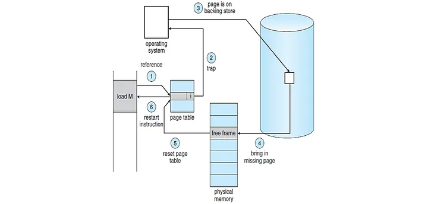

* TOC
  {:toc}

Virtual memory is a concept designed to overcome the limitations of physical memory capacity. For example, 
consider a scenario where you want to run software that requires 200MB while your physical memory is only 100MB. 
Virtual memory employs a strategy where only the necessary portions are loaded into memory for immediate execution. 

While the capacity of virtual memory is theoretically unlimited, it is practically constrained by the physical memory 
capacity. The size of virtual memory is the sum of physical memory and the swap space.

### **Demanding page**

Paging refers to dividing logical memory, i.e., virtual addresses, into fixed-size units, while a frame signifies 
dividing physical memory into fixed-size units. The paging technique utilizes a fixed partitioning method, where the 
physical address space is divided into equal-sized portions. Since pages and frames have the same size, 
a one-to-one mapping is possible, and the mapping details are recorded in the Page Table.

Demand Paging involves loading only the pages required for the current process execution into memory. 
The Page Table includes a Valid bit, indicating the presence of the corresponding page-frame pair in memory. 
If the current page is loaded into memory, the Valid bit is set to 1; otherwise, it is set to 0.

### **Page Fault**

This occurs when the CPU attempts to access a page that is not in memory, meaning the valid bit in the page table is 0, 
resulting in a Page Fault. The handling process when a Page Fault occurs involves the following steps:

To check if the page is in memory, examine the valid bit. If the valid bit is 0, send an interrupt signal to the CPU, 
causing a jump to the corresponding Interrupt Service Routine (ISR) within the operating system.

In the ISR, search the disk (backing store) to find the page for the respective process. Allocate this page to an 
available frame, update the page table with the frame number, and change the valid bit to 1.

Return to the instruction and execute it.

**Pure Demanding Paging**  
When a process initially runs, it is impossible to know which pages are needed, so no pages are loaded. Page faults occur 
immediately upon program execution, indicating that only the strictly necessary pages are loaded.

The advantage of Pure Demanding Paging is efficient memory utilization. However, the drawback is the initial slowdown 
due to immediate page faults.

**Pre-paging**  
Contrary to pure demanding paging, pre-paging involves loading pages predicted to be needed when the program runs. 
While it reduces the probability of page faults, it may lead to memory wastage if the pre-loaded pages are not used.

**Swapping & Demanding Paging**  
Both perform the function of moving data between memory and a backing store. The difference lies in Swapping, 
which moves at the process level, and Demanding Paging, which moves at the page level.

### **Effective Access Time**
Demanding Paging involves bringing a page from the backing store to memory when it is not in the page table.
Therefore, there is a time difference between having and not having the page in the page table. 
The calculation of the average time considering this difference is referred to as Effective Access Time.

The probability of a page fault is extremely low due to the principle of Locality of Reference. 
This principle encompasses both temporal locality and spatial locality.

- Temporal Locality 
After the CPU reads a certain memory space, there is a high probability that it will read the same space again, even after some time has passed.
- Spatial Locality 
When the CPU reads a specific memory space, it tends to read within the adjacent range. This is particularly true in procedural programming, where reading sequentially is common.

**Page Replacement**  
Demanding Paging brings in only the required pages from the backing store. However, as programs continue to run, the 
demand for pages keeps increasing. Eventually, the memory will become full. In such a scenario, if a different program 
is executed or an existing process demands other pages, the pages that are already in memory are sent to the backing 
store—this is known as page-out. On the other hand, the pages that have been page-out to the backing store are referred 
to as **victim pages.**